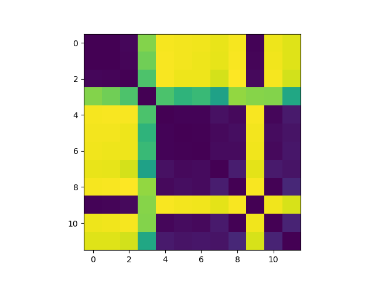
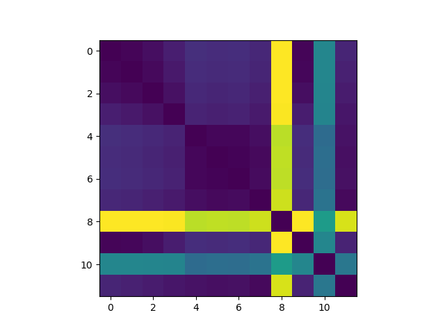
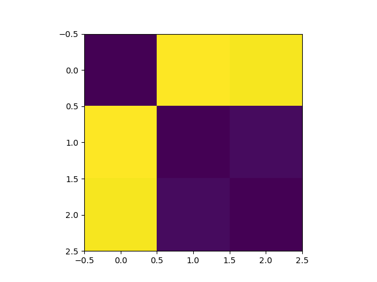
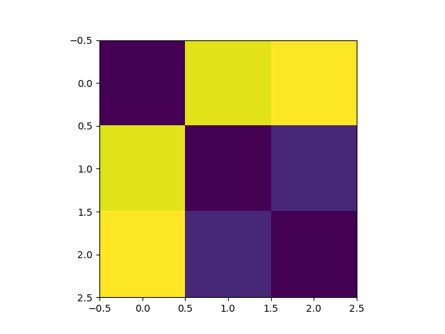
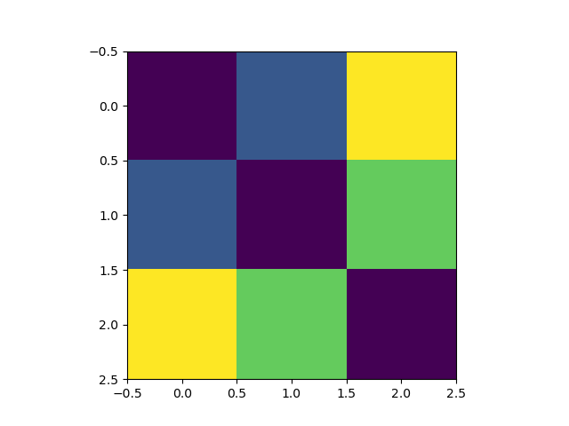
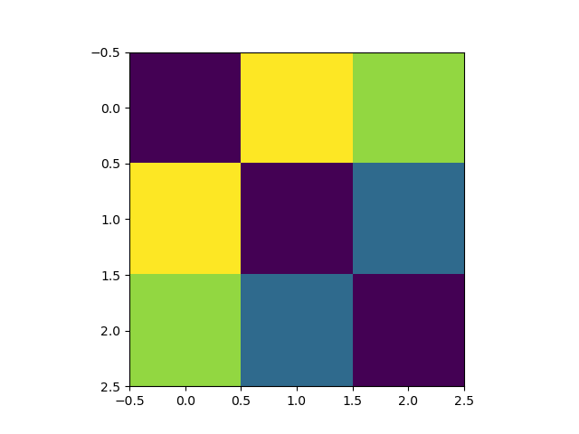
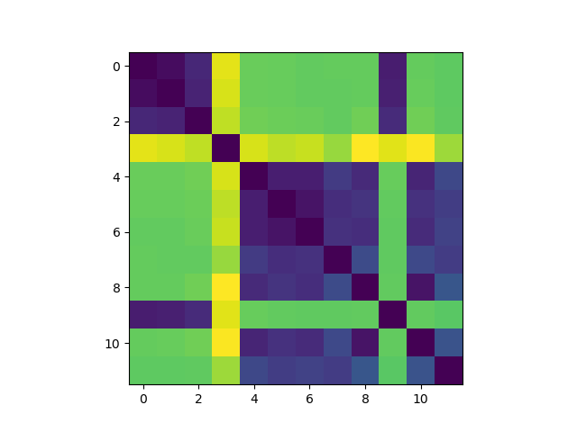

# Representational Similarity Analysis Project

Pearson Correlation on RELU                             | Euclidean Distance on RELU
:------------------------------------------------------:|:-------------------------------------------------:
 | 

## Overview

This project demonstrates the application of statistical techniques and machine learning methods to address a fundamental question in interpretability research and cognitive neuroscience:  how "alike" are the representations used in different machine learning models and brains?  Representational Similarity Analysis (RSA) aims to answer this question.

The fundamental finding is that artifacts of statistical modeling can change the headline conclusion used in RSA because they can inadvertently pick up on architectural features of the model.  Consequently, careful selection of statistical techniques needs to be employed when using RSA to do interpretability work in machine learning or cognitive neuroscience.

To reach the conclusion, I constructed a series of data sets, and I trained different neural network classifiers on those data sets.  Representations in the penultimate layer of each network were then compared using different versions of RSA.  Those versions relied upon similarity metrics that include Pearson Correlation, Spearman Correlation, Euclidean distance, and Absolute distance.  Representational Dissimilarity Matrices (RDM) were then constructed using the statistical data to study how the neural networks' representations compared.

## Data Sets

Each data set consisted of samples of 512 floating point numbers drawn from either Gaussian, Beta, or Gamma distributions.  Data sets were constructed as either "coarse" grained or "fine" grained.  A fine grained data set is a collection of samples from a specific probability distribution with specific parameters, while a coarse grained data set is the union of each fine grained set for a specific functional form.  Four sets of parameters for each distribution were used to generate fine grained data sets.  A fine grained data set produced by a specific distribution on specific parameters has 10,000 samples; a coarse grained data set produced by a specific distribution has 40,000 samples; and the total size of all data sets networks were trained on is 120,000 samples.

Data sets were saved in pickle files and manipulated using Python's dictionary functionality along with Pytorch's data set class.

## Statistical Methods

RSA works by comparing how neurons (in both models and the brain) respond to samples from a variety of categories.  For example, in object recognition, the activation patterns of images of monkeys, lemurs, snakes, and cars can be compared to assess how a similar a model's activation patterns are among images of the same and different categories.  If two models rank monkeys as similar to lemurs but different from snakes and more different from cars, then we might say the models are representing monkeys, lemurs, snakes, and cars in a likewise manner.  A RDM can then be constructed by comparing the computed similarity metrics across different categories of samples.  Models with similar representations will have visually very close RDMs.

Similarity is measured by either correlation or distance.  I employed two techniques to assess correlation:  Pearson product-moment and Spearman rank correlation.  If a representation is seen as a vector from the origin, correlation can be thought of as measuring the relative angle between representations.  Distance, however, measures the difference in magnitude between representations.  I used Euclidean and Absolute distance.  Euclidean distance captures how similar representations are with both distance and magnitude; absolute distance captures only the magnitude.

I used `numpy` and `scipy.stats` to compute the correlations and distances between representations of my models.  All operations to construct RDMs were done using `numpy` and `matplotlib`.

## Machine Learning Methods

A variety of neural network models were used to learn representations.  Each architecture was custom designed in `pytorch` to test hypotheses about the relevance of similarity metrics for RSA.  Two broad categories of models were used.  The first are simple feedforward neural networks with only 1 hidden layer.  The second were feedforward neural networks with multiple hidden layers and parameter counts.  The smallest model had 32,960 parameters and the largest model had 172,800 parameters.  Models also varied in their activation functions.  Sigmoid, RELU, and smoothstep were all utilized as given `pytorch`.

Models were trained on data sets and then validated on a hold-out test set.  Training was done on Google Colab, and `pytorch` was used to train the models with `cuda`.  For conducting RSA experiments, trained models had their parameters copied minus the final layer used for making predictions.

## Experiments

Experiments were run on 12 different models.  After training and validation, representations for each model's penultimate layer were compared using 4 different similarity metrics.  RDMs were constructed and displayed by `matplotlib`, and they can be found below.

## Results

The results of experiments showed mismatches between RDMs constructed with correlation and distance metrics on neural networks with RELU activation functions.  For example at the coarse-grained level where RDMs are measuring similarity of the functional form of distributions (Gaussian compared to Beta compared to Gamma), the ordering of RDMs is reversed for RELU networks but not for Sigmoid networks.  The order going from top to bottom and left to right of the distributions are Gaussian, Beta, and Gamma.  Lighter colors means the representation is more dissimilar:

 Similarity Metric  | RELU Network                                                     | Sigmoid Network
:------------------:|:----------------------------------------------------------------:|:------------------------------------------:
Pearson Correlation |  | 
Euclidean Distance  |       | 

These findings were more pronounced when viewing the RDMs for fine grained classification of generating distributions.  

Due to the effect being found in RELU networks and not Sigmoid networks, I hypothesized the problem could be fixed by renormalizing the inputs of the network before constructing the RDM.  Subsequent experiments showed this partially worked, but the problem still appears for the RDMs for fine grained classification task.  This can be seen below when normalization is applied to the Euclidean distance metric.  Going from top to bottom and left to right, the distributions are Gaussian on 4 different parameters, Beta on 4 different parameters, and Gamma on 4 different parameters.  Again, lighter means the representations are more dissimilar:

 Similarity Metric  | Fine Grained RELU                                                | Fine Grained Renormalized RELU
:------------------:|:----------------------------------------------------------------:|:------------------------------------------:
Pearson Correlation |  | 
Euclidean Distance  |       | 

Note that even after renormalization, the images in the right column still differ in how they order representations based on the coloring.

Full results are discussed in the companion paper, which was written in Latex.

## Discussion

The important takeaway is that **interpretability results may not track the features of our models because our statistical methods pick up other architectural features**.  In this case, the similarity metric used in RSA actually seems to pick up on the nonlinear activation function of our models.  This may affect the conclusion our analysis would give:  we might errantly conclude that representations between models or brains are similar or dissimilar when our results happen to fixate on an interaction between our statistical tools and the activation functions used in the model.

## Further Reading

For further analysis please [read the full report write-up](Rushing_RSA_draft1.pdf).
