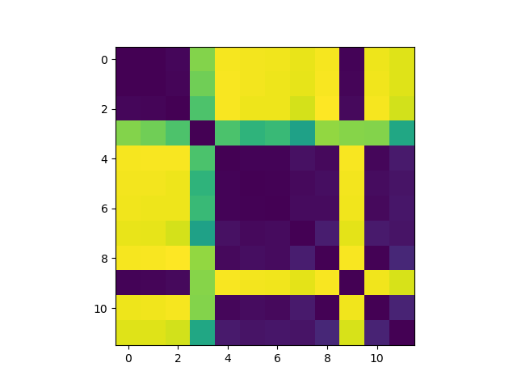
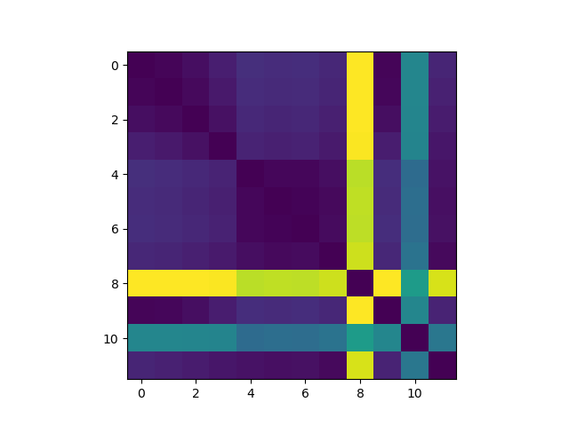

# Representational Similarity Analysis Project

Pearson Correlation                                     | Euclidean Distance
:------------------------------------------------------:|:-------------------------------------------------:
 | 

## Overview

This project demonstrates the application of statistical techniques and machine learning methods to address a fundamental question in interpretability research and cognitive neuroscience:  how "alike" are the representations used in different machine learning models and brains?  Representational Similarity Analysis (RSA) aims to answer this question.

The fundamental finding is that artifacts of statistical modeling can change the headline conclusion used in RSA.  Consequently, careful selection of statistical techniques needs to be employed when using RSA to do interpretability work in machine learning or cognitive neuroscience.

To reach the conclusion, I constructed a series of data sets, and I trained different neural network classifiers on those data sets.  Representations in the penultimate layer of each network were then compared using different versions of RSA.  Those versions relied upon similarity metrics that include Pearson Correlation, Spearman Correlation, Euclidean distance, and Absolute distance.  Representational Dissimilarity Matrices (RDM) were then constructed using the statistical data to study how the neural networks' representations compared.

## Data Sets

Each data set consisted of samples of floating point numbers drawn from either Gaussian, Beta, or Gamma distributions.  Data sets were constructed as either "coarse" grained or "fine" grained.  A fine grained data set is a collection of samples from a specific probability distribution with specific parameters, while a coarse grained data set is the average A sample contains 512 floats; a data set contains 120,000 samples for 

## Statistical Methods

## Machine Learning Methods

## Experiments

## Results

## Discussion
